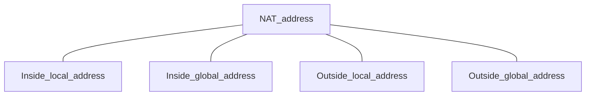
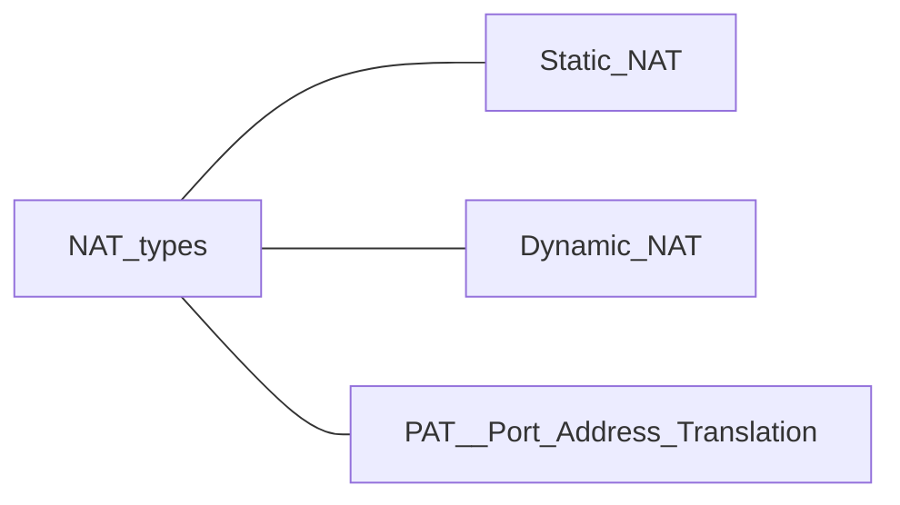
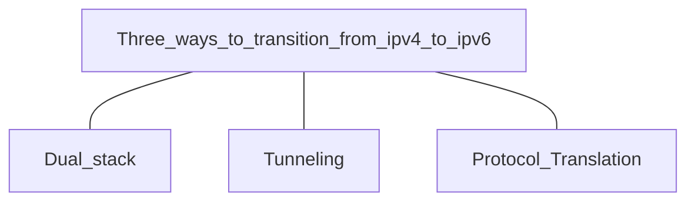
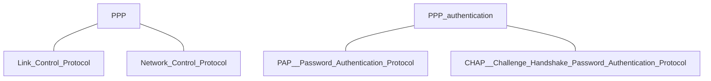
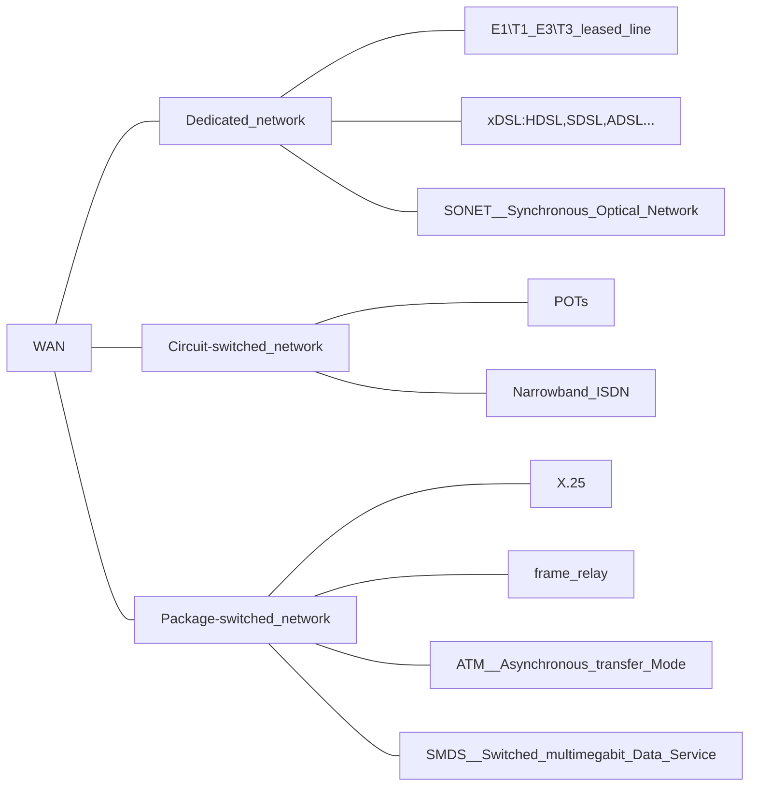

# LAN-WAN-Network-Basic-Graph

## Catalog

- LAN

  - Chapter 1: LANs Technology – Switched LANs

  - Chapter 2: LANs Technology – Virtual LANs

  - Chapter 3: LANs Technology – Wireless LANs

- NAT (Network Address Translation)

  - Chapter 4: Addressing Technology - Address Assignment and Translation

- WAN
  - Chapter 5: WANs Technology - Dedicated Networks
  - Chapter 6: WANs Technology - Circuit-switched Networks
  - Chapter 7: WANs Technology - Packet-switched Networks


## LAN

- Wireless LANs

  - ==IEEE 802.11==(==Wi-Fi==)

    | NO.     | IEEE standard      | Speed         | Frequency                   | Technology    |
    | ------- | ------------------ | ------------- | --------------------------- | ------------- |
    | Wi-fi 1 | IEEE 802.11.==b==  | ==11== Mbps   | ==2.4== GHz                 | DSSS          |
    | Wi-fi 2 | IEEE 802.11.==a==  | ==54== Mbps   | ==5== GHz                   | OFDM          |
    | Wi-fi 3 | IEEE 802.11.==g==  | ==54== Mbps   | ==2.4== GHz                 | OFDM          |
    | Wi-fi 4 | IEEE 802.11.==n==  | ==600== Mbps  | ==2.4== , ==5== GHz         | OFDM and MIMO |
    | Wi-fi 5 | IEEE 802.11.==ac== | ==3.46== Gbps | ==5== GHz                   | OFDM and MIMO |
    | Wi-fi 6 | IEEE 802.11.==ax== | ==9.60== Gbps | ==2.4== , ==5== , ==6== GHz | OFDM and MIMO |
    | Wi-fi 7 | IEEE 802.11.==be== | ==30== Gbps   | ==2.4== , ==5== , ==6== GHz |               |

- WLAN Security

  ```mermaid
  graph
  WLAN_security --- Authentication
  WLAN_security --- Encryption
  
  Authentication --- EAP__Extensiible_Authentication_Protocol
  Encryption --- WAP__Wi-Fi_Alliance
  Encryption --- TKIP
  Encryption --- AES
  ```

  

## NAT

- NAT operates at ==Layer 3==(Network Layer) Technology








## WAN






- Dedicated Network

  ```mermaid
  graph
  T1\E1_leased_line --- CSU
  T1\E1_leased_line --- DSU
  ```

  ```mermaid
  graph
  DSL --- DSLAM
  ```

  

